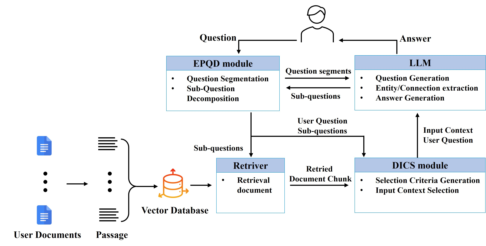

# DS-RAG: Enhancing Multi-Document Question-Answering for Commercial Applications
This is the repo of our paper "Dynamic Selection based RAG System: Enhancing Multi-Document Question-Answering for Commercial Applications"

We introduce the **DS-RAG** system, an effective approach for retrieving multi-documents to address complex questions. QGS-RAG identifies the core elements of a question through a Question Graph, allowing flexible selection of the necessary documents. DS leverages the strengths of Graph Attention Networks (GAT) to enhance graph-based reasoning and utilizes LLMs to provide tailored answers to users.



## Environment setup
```
conda create --name ds_rag python=3.10 -y
conda activate ds_rag

pip install torch==2.4.0 torchvision==0.19.0 torchaudio==2.4.0 --index-url https://download.pytorch.org/whl/cu121

#Check Install
python -c "import torch; print(torch.__version__); print(torch.cuda.is_available())"

pip install pyg_lib torch_scatter torch_sparse torch_cluster torch_spline_conv -f https://data.pyg.org/whl/torch-2.4.0%2Bcu121.html

pip install tqdm
pip install openai
pip install matplotlib
pip install python-dotenv
pip install space
python -m spacy download en
pip install groq
pip install transformers
pip install fuzzywuzzy
pip install pandas
pip install torch_geometric
pip install scikit-learn
pip install wandb
pip install langchain
pip install langchain-openai langchain-community
pip install anls
```

## Preprocess Train Dataset
#### 1. Question Decomposition

    python question_decomposition.py

#### 2. Graph Construction

    python generate_graph_llm.py

#### 3. Prerprocssing Graph

    python preprocess_graph.py

#### 4. Get the Train Batch

    python get_batch_size.py

## Train Model

    python train_model.py --gpu_device cuda:0 --expt_name comparison_GAT --hidden_dim 3072 --out_dim 1536 --weight_opt 5 --num_epochs 50 --batch_size 16 --lr 5e-6 --dropout 0.3 --seed 32

## Inference
    #1 Generate vectorestore
    python store.py
    #2 DS-RAG
    python ds_rag.py

